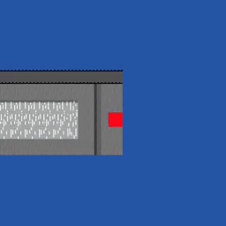

# RPG Base

Not actually a base for RPGs - more like an editor.. just not *that* one.

Based on the
[Official Hamster Republic Role Playing Game Creation Engine][ohrrpgce]. That's
the only thing it's based on.

## Please don't pull request me or whatever

This repository is here to show off the code and let people try out the project
first-hand. That's all. I'm not looking into getting pull requests or issues or
whatever, please don't spam them here!

**But,** if you *do* have a cool idea, by all means tell me about it.
Probably your best way to do that would be by tweeting to me
([@towerofnix][twitter]). You could email me too (if you have my email), but
then you'd sound serious and important, and that probably wouldn't be good,
and to make things worse, your idea wouldn't even be public. (Same deal goes
with other private message services like Gitter and such.)

## Please don't whine about my code

..unless you have a really, *really* good and obvious improvement to a mistake
I made. Those are cool.

## Installing

The program is an [Electron][electron] app, so you'll need to get that
installed first. Then install:

```sh
$ npm install
```

..and run:

```sh
$ electron .
```

## Usage

No documentation right now because I'm lazy. Just read the commit messages, try
out [OHRRPGCE][ohrrpgce] and come back, and maybe also guess.

  [twitter]: https://twitter.com/towerofnix
  [ohrrpgce]: https://rpg.hamsterrepublic.com/ohrrpgce/
  [electron]: http://electron.atom.io/
